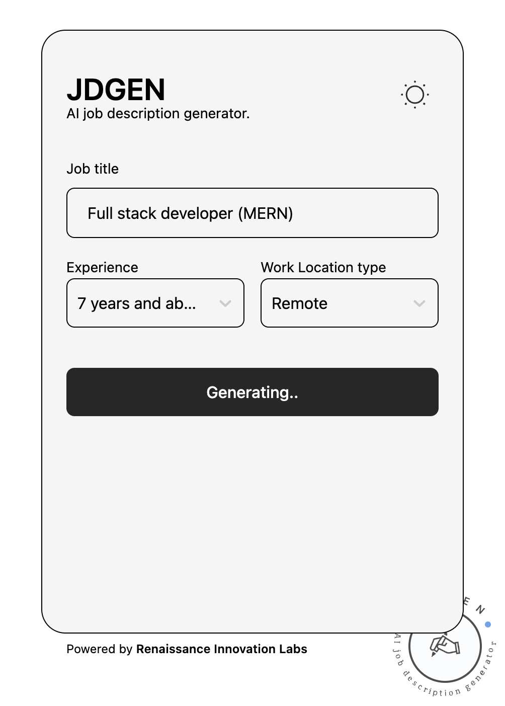
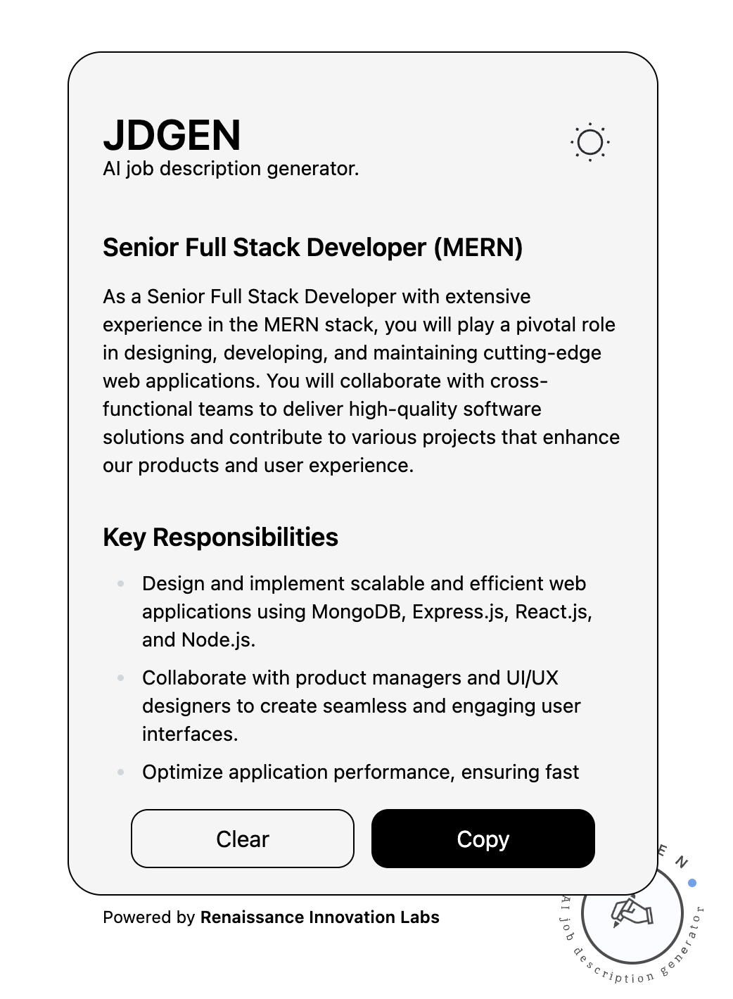
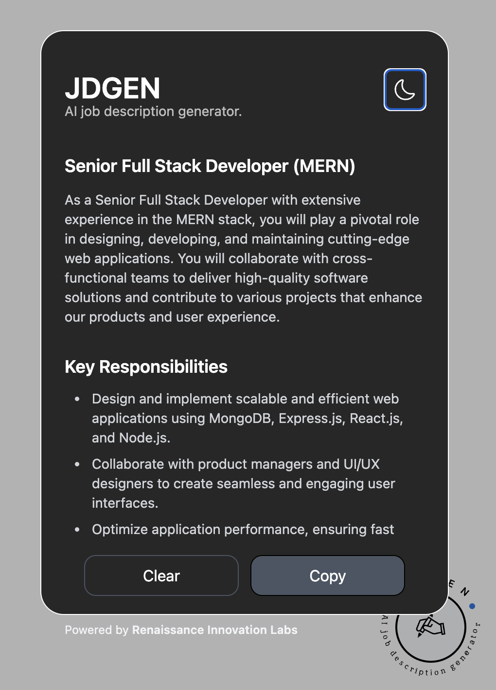

# JDGEN WIDGET

The primary objective of JDGEN is to assist job recruiters and companies in generating accurate and tailored job descriptions for various roles they are hiring for. The widget aims to eliminate the common practice of copying and pasting job descriptions that may not fit specific roles, ensuring that the requirements and responsibilities listed are appropriate for the position being advertised.

## Features

1. Generate job description based on the role, experience level and work location type
2. Copy generated job description.
3. Toggle between dark and light theme

## Screenshots.





## Get Started

To get started with this repository, follow these steps:

1. **Fork the repository:**

   Click on the fork icon on the repository which create a copy of the repository.

2. **Clone your forked repository:**

   ```bash
   git clone https://github.com/Dr-Oxy/jdgen.git
   ```

3. **Navigate to the project directory:**

   ```
   cd jdgen
   ```

4. **Set up development environment**
   Install dependencies

   ```
   npm install
   ```

Add .env file

```
REACT_APP_OPEN_API_KEY=sk-xyxyxyxyxyxyxyxyyx

```

Run development

```

npm start

```

## Contributing

This is open for conatributions. Please fork the repository and customize this template further based on your specific needs and additional features.

1. **Fork the repository**
2. **Create a new branch**: `git checkout -b feature/your-feature-name`
3. **Make your changes**
4. **Commit your changes**: `git commit -m 'Add some feature'`
5. **Push to the branch**: `git push origin feature/your-feature-name`
6. **Create a pull request**

## License

This repository is licensed under the MIT License. For more details, please look at the [LICENSE](LICENSE) file.

```

```
